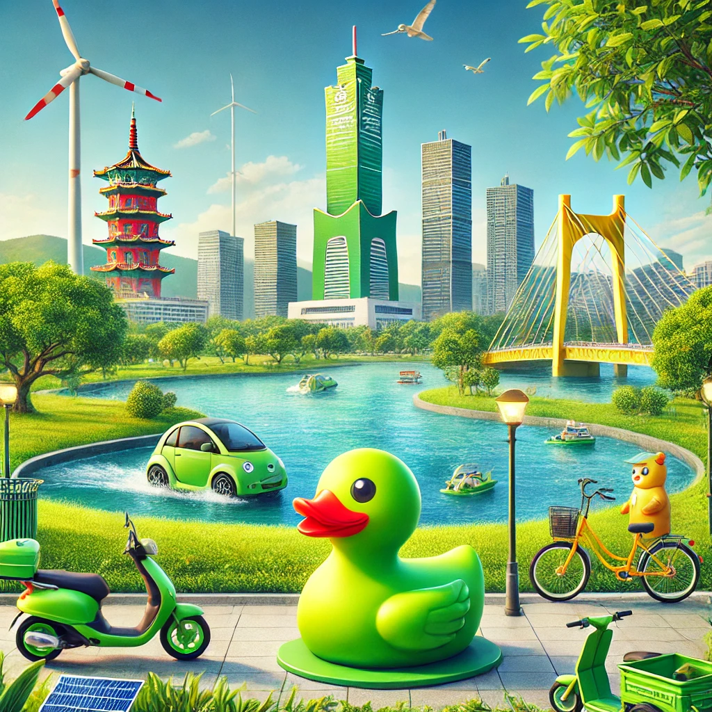
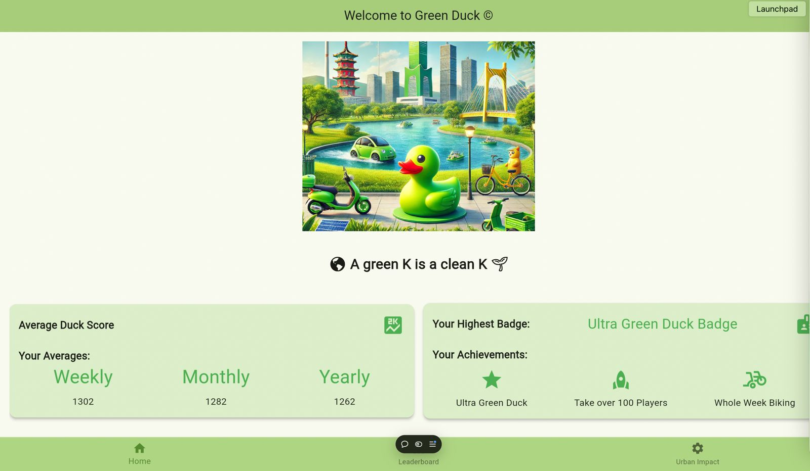
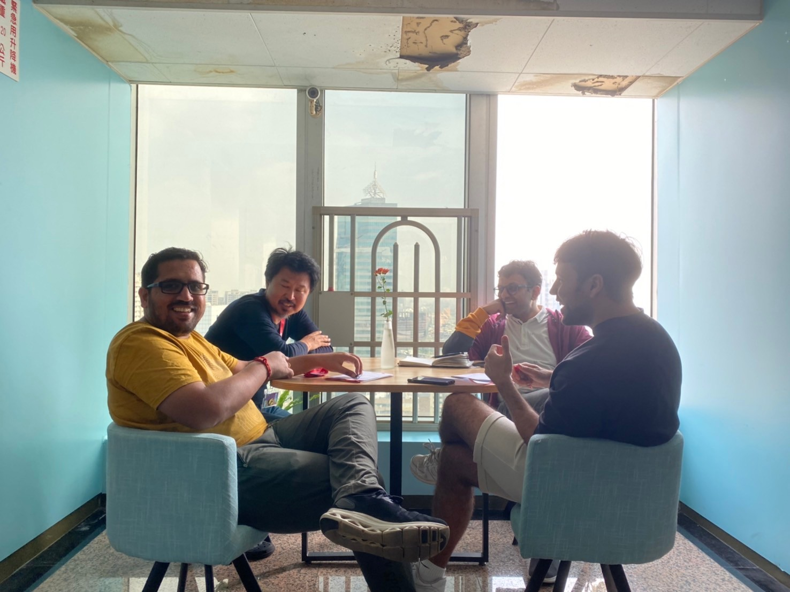

<a name="readme-top"></a>


<h1 align="center">Green Duck 🦆: A Green K is a Clean K!</h1>

<!-- PROJECT LOGO -->
<br />
<div align="center">
  <!-- You should link the logo to the pub dev page of you project or a homepage otherwise -->
  <a href="https://github.com/Flutterando/README-Template/">
    
  </a>

  <p align="center">
        Green Duck 🦆 is a Flutter web application designed to promote eco-friendly practices and encourage users to contribute to a greener environment, specifically focusing on the city of Kaohsiung. The app features a leaderboard for tracking eco-friendly activities and scores, daily quests to encourage sustainable actions, and visual statistics on the impact of these actions.
    <br />
    <br />
    <!-- Disable unused links with with comments -->
    <a href="https://greenduck.vercel.app/">View Demo</a>
    ·
    <!-- The Report Bug and Request Feature should point to the issues page of the project, in this example we use the pull requests page because this is a github template -->
    <a href="https://github.com/mojoee/README-Template/pulls">Report Bug</a>
    ·
    <a href="https://github.com/mojoee/README-Template/pulls">Request Feature</a>
  </p>

<br>

<!--  SHIELDS  ---->


<!-- The shields here are an example of what could be used and are the most recommended, there are more below in the "some recomendations about shields" section. 
See the links in the example below, changing the parts after img.shields.io you can change the content of the shields. Alternatively, go to the website and generate new shields.  

The ones used here are:
- Release version
- Pub Points
- style: Flutterando analysis
- publisher: Flutterando --->


</div>

<!----
About Shields, some recommendations:
+-+
Build - GithubWorkflow ou Github Commit checks state
CodeCoverage - Codecov
Chat - Discord 
License - Github
Rating - Pub Likes, Pub Points and Pub Popularity (if still in early stages, we recommend only Pub Points since it's controllable)
Social - GitHub Forks, Github Org's Stars (if using Flutterando as the main org), YouTube Channel Subscribers (Again, using Flutterando, as set in the example)
--->

<br>

---
<!-- TABLE OF CONTENTS -->
<!-- Linked to every ## title below -->
<details>
  <summary>Table of Contents</summary>
  <ol>
    <li><a href="#about-the-project">About The Project</a></li>
    <li><a href="#sponsors">Sponsors</a></li>
    <li><a href="#getting-started">Getting Started</a></li>
    <li><a href="#how-to-use">How to Use</a></li>
    <li><a href="#features">Features</a></li>
    <li><a href="#contributing">Contributing</a></li>
    <li><a href="#contact">Contact</a></li>
    <li><a href="#acknowledgements">Acknowledgements</a></li>
  </ol>
</details>

---

<br>

<!-- ABOUT THE PROJECT -->
## About The Project


<!-- PROJECT EXAMPLE (IMAGE) -->

<br>
<Center>

</Center>

<br>

<!-- PROJECT DESCRIPTION -->

Here you can write lenghtier descriptions of your project, going deeper about it's uses, how it came to be, aims, and whatever more is necessary for the client/user to understand it. 

Be aware that you need to be direct, since this Readme is oriented to guide rather than teach how to use the project. 

Anything more and you should point to the official documentation of your project.

<i>This project is distributed under the MIT License. See `LICENSE.txt` for more information.
</i>

<p align="right">(<a href="#readme-top">back to top</a>)</p>


<!-- GETTING STARTED -->
## Features

- **Leaderboard**: A comprehensive leaderboard that displays user scores based on metrics such as health, energy, and pollution. Users can see their rankings and compare their performance with peers, motivating friendly competition.
- **Daily Quests**: Offers daily challenges that encourage users to take eco-friendly actions, such as riding bikes, using public transportation, and reducing vehicle emissions. Completing quests rewards users with points that contribute to their overall score.
- **Moving Banner**: An animated banner that scrolls important environmental messages across the screen, reminding users of the importance of their actions.
- **Gamification Elements**: Incorporates badges, rewards, and achievements to keep users engaged and motivated to continue participating.
- **Responsive Design**: Ensures a seamless experience across a variety of devices, making it easy to access on desktops, tablets, and mobile phones.

## How It Works

Green Duck tracks user engagement through specific eco-friendly activities and records points in real-time. The leaderboard updates automatically to reflect the accumulated scores, which are composed of three main components:
- **Health Score**: Points earned by participating in activities that promote physical well-being, like walking or cycling.
- **Energy Score**: Points related to the use of energy-efficient or public transportation methods.
- **Pollution Reduction Score**: Points awarded for reducing carbon emissions, such as carpooling or opting for non-motorized travel.

The cumulative **Duck Score** is a sum of these three individual scores and determines a user’s ranking on the leaderboard.

## Technologies Used

- **Flutter**: The framework used for building this cross-platform web application.
- **Dart**: The primary programming language utilized to develop the app.
- **Vercel**: The platform used for seamless web deployment, ensuring high performance and availability.

## Installation

Clone the repository:
```bash
git clone https://github.com/mojoee/green-duck.git
cd green-duck
flutter pub get
flutter run -d chrome
flutter build web
vercel --prod --force
```


<!-- CONTRIBUTING -->
## Contributing
 
🚧 [Contributing Guidelines]() - _Work in Progress_ 🚧
<!---- Flutterando Contributing Guidelines are currently a work in progress.
We recommend to keep the text below the way it is. 
 --->

Contributions are what make the open source community such an amazing place to learn, inspire, and create. Any contributions you make are **greatly appreciated**.

If you have a suggestion that would make this better, please fork the repo and create a pull request. You can also simply open an issue with the appropriate tag. 
Don't forget to give the project a star! Thanks again!

1. Fork the Project
2. Create your Feature Branch (`git checkout -b feature/AmazingFeature`)
3. Commit your Changes (`git commit -m 'Add some AmazingFeature'`)
4. Push to the Branch (`git push origin feature/AmazingFeature`)
5. Open a Pull Request

Remember to include a tag, and to follow [Conventional Commits](https://www.conventionalcommits.org/en/v1.0.0/) and [Semantic Versioning](https://semver.org/) when uploading your commit and/or creating the issue. 

<p align="right">(<a href="#readme-top">back to top</a>)</p>

<!-- CONTACT -->

<!---- Those are my current contacts as of 8th November 2024 --->
## Contact

How to contact
- [Medium](https://medium.com/@moritzsontheimer)
- [Website](https://www.moritzsontheimer.cool)
- [LinkedIn](https://www.linkedin.com/in/moritz-sontheimer/)


<p align="right">(<a href="#readme-top">back to top</a>)</p>

<!-- ACKNOWLEDGEMENTS -->
## Acknowledgements 

We extend our gratitude to the HYD 2024 organizers for providing a platform to showcase this project, and to all the participants who made the event inspiring. Special thanks to our development team and the open-source community for the tools and libraries that facilitated the building of this application.

<br>

<!---- Change the link below to the contributors page of your project and change the repo= in the img src to properly point to your repository -->

<a href="https://www.tu.berlin/en/arte/research/projects/hackyourdistrict/hackyourdistrict-2024">
  
</a>

<!-- Here is an alternative to the contributors page: https://allcontributors.org/
And the link for the currently used option in this readme: https://contrib.rocks/ -->


<p align="right">(<a href="#readme-top">back to top</a>)</p>

<!-- MANTAINED BY -->
## Maintaned by

<br>
  <p align="center">
    Built and maintained by <a href="https://www.moritzsontheimer.cool">Moritz Sontheimer</a> and <a href="https://github.com/vomseok"> Yonseok Kwon </a>.
  </p>
</p>


<!-- MARKDOWN LINKS & IMAGES -->
<!-- https://www.markdownguide.org/basic-syntax/#reference-style-links -->

<!-- [Choose an Open Source License](https://choosealicense.com)
[GitHub Emoji Cheat Sheet](https://www.webpagefx.com/tools/emoji-cheat-sheet)
[Malven's Flexbox Cheatsheet](https://flexbox.malven.co/)
[Malven's Grid Cheatsheet](https://grid.malven.co/)
[Img Shields](https://shields.io)
[GitHub Pages](https://pages.github.com)
[Font Awesome](https://fontawesome.com)
[React Icons](https://react-icons.github.io/react-icons/search) 

[contributors-shield]: https://img.shields.io/github/contributors/othneildrew/Best-README-Template.svg?style=for-the-badge
[contributors-url]: https://github.com/othneildrew/Best-README-Template/graphs/contributors
[forks-shield]: https://img.shields.io/github/forks/othneildrew/Best-README-Template.svg?style=for-the-badge
[forks-url]: https://github.com/othneildrew/Best-README-Template/network/members
[stars-shield]: https://img.shields.io/github/stars/othneildrew/Best-README-Template.svg?style=for-the-badge
[stars-url]: https://github.com/othneildrew/Best-README-Template/stargazers
[issues-shield]: https://img.shields.io/github/issues/othneildrew/Best-README-Template.svg?style=for-the-badge
[issues-url]: https://github.com/othneildrew/Best-README-Template/issues
[license-shield]: https://img.shields.io/github/license/othneildrew/Best-README-Template.svg?style=for-the-badge
[license-url]: https://github.com/othneildrew/Best-README-Template/blob/master/LICENSE.txt
[linkedin-shield]: https://img.shields.io/badge/-LinkedIn-black.svg?style=for-the-badge&logo=linkedin&colorB=555
[linkedin-url]: https://linkedin.com/in/othneildrew
[product-screenshot]: images/screenshot.png
[Next.js]: https://img.shields.io/badge/next.js-000000?style=for-the-badge&logo=nextdotjs&logoColor=white
[Next-url]: https://nextjs.org/
[React.js]: https://img.shields.io/badge/React-20232A?style=for-the-badge&logo=react&logoColor=61DAFB
[React-url]: https://reactjs.org/
[Vue.js]: https://img.shields.io/badge/Vue.js-35495E?style=for-the-badge&logo=vuedotjs&logoColor=4FC08D
[Vue-url]: https://vuejs.org/
[Angular.io]: https://img.shields.io/badge/Angular-DD0031?style=for-the-badge&logo=angular&logoColor=white
[Angular-url]: https://angular.io/
[Svelte.dev]: https://img.shields.io/badge/Svelte-4A4A55?style=for-the-badge&logo=svelte&logoColor=FF3E00
[Svelte-url]: https://svelte.dev/
[Laravel.com]: https://img.shields.io/badge/Laravel-FF2D20?style=for-the-badge&logo=laravel&logoColor=white
[Laravel-url]: https://laravel.com
[Bootstrap.com]: https://img.shields.io/badge/Bootstrap-563D7C?style=for-the-badge&logo=bootstrap&logoColor=white
[Bootstrap-url]: https://getbootstrap.com
[JQuery.com]: https://img.shields.io/badge/jQuery-0769AD?style=for-the-badge&logo=jquery&logoColor=white
[JQuery-url]: https://jquery.com  -->
